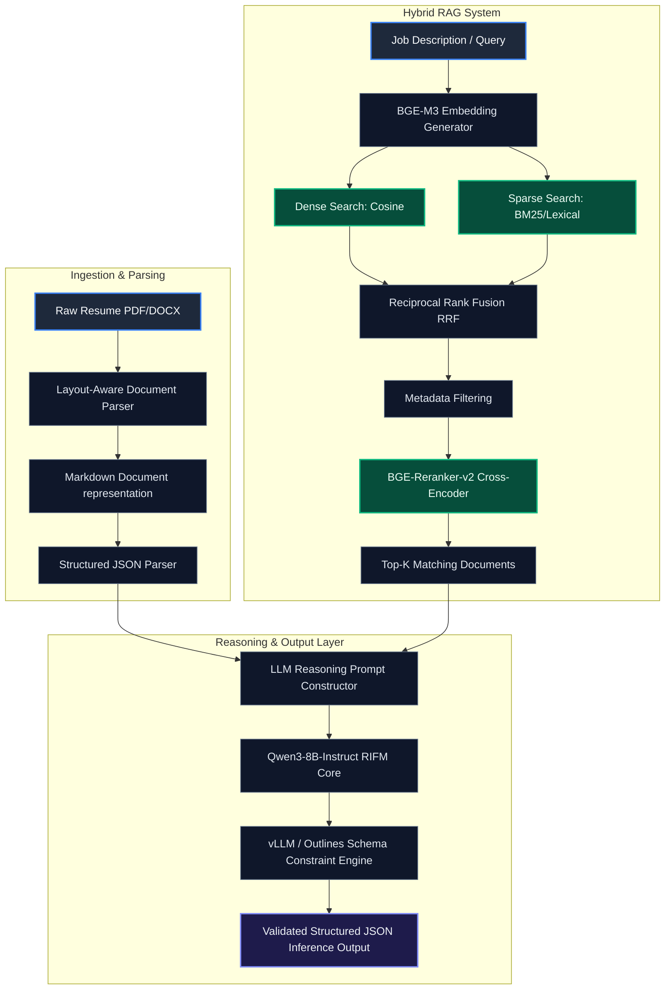
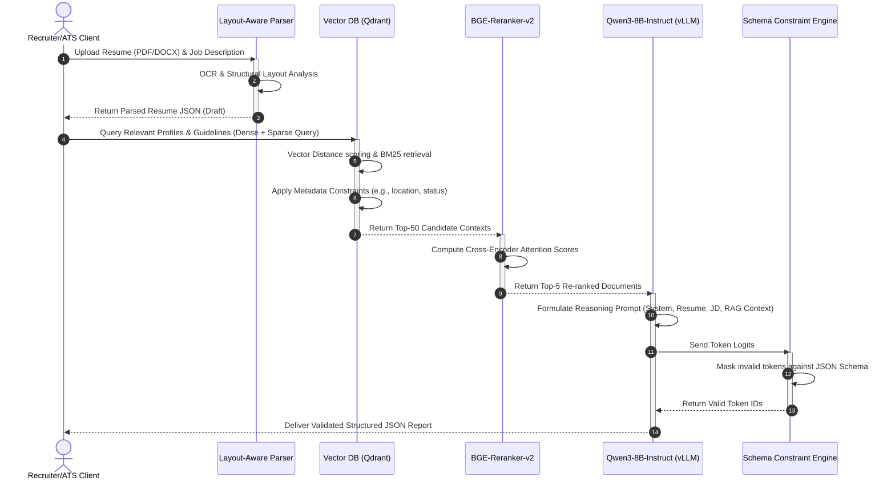

# Resume Intelligence Foundation Model (RIFM)

RIFM is a production-grade, domain-specialized AI reasoning system designed for parsing, analyzing, scoring, and matching resumes with job descriptions. Built on a fine-tuned **Qwen3-8B-Instruct** transformer, RIFM enforces structural alignment and logical rigor using a hidden `<reasoning>` Chain-of-Thought (CoT) phase prior to generating schema-validated JSON outputs.

---

## 1. System Architecture & Flow

RIFM couples layout-aware parsing and hybrid semantic vector retrieval with model guided decoding to ensure structured output consistency.

### High-Level Components


### End-to-End Sequence Flow


---

## 2. Directory Structure

The project has been structured according to standard software engineering designs:

```text
ai-resume-analyser/
├── config/                         # Configuration templates
│   ├── deepspeed_zero3.json        # DeepSpeed training configs
│   ├── peft_lora_config.json       # PEFT/LoRA adaptation parameters
│   └── serving_config.yaml         # Serving config template
├── data/                           # Data storage & pipelines
│   ├── raw/                        # Ingested scraped datasets
│   ├── processed/                  # Normalized and deduplicated datasets
│   └── scripts/
│       ├── deduplicate_lsh.py      # MinHash LSH deduplication script
│       └── generate_synthetic.py   # Synthetic instruction pair generator
├── src/                            # Codebase Source
│   ├── parser/
│   │   ├── document_parser.py      # OCR / Layout markdown parser
│   │   └── schema_verifier.py      # Pydantic schemas and output parsing verifier
│   ├── search/
│   │   ├── embedder.py             # BGE-M3 dense/sparse embedding generator
│   │   ├── hybrid_retriever.py     # Qdrant search & RRF merger
│   │   └── reranker.py             # BGE-Reranker-v2 cross encoder
│   └── training/
│       ├── train.py                # SFT QLoRA fine-tuning training script
│       └── evaluate.py             # ROUGE-L, MAE, Skill metrics calculator
├── tests/                          # Integration tests folder
│   └── test_integration.py         # End-to-end unittest suite
├── Dockerfile                      # Production build image instructions
├── docker-compose.yml              # Cluster services setup (Qdrant + FastAPI)
└── requirements.txt                # System dependency configuration
```

---

## 3. Local Setup & Quickstart

### Prerequisites
- Python 3.10+
- CUDA-compatible environment (recommended for active SFT training)
- Docker & Docker Compose (optional, for orchestrating container builds)

### 3.1 Install Dependencies
```bash
pip install -r requirements.txt
```

### 3.2 Data Preprocessing & Generation
1. **Generate Synthetic Instruction Tuning Dataset**:
   ```bash
   python data/scripts/generate_synthetic.py
   ```
   This will construct 100 mock resume-JD instruction matching pairs saved as ChatML jsonl structures under `data/processed/synthetic_sft.jsonl`.
   
2. **Run LSH Deduplication**:
   ```bash
   python data/scripts/deduplicate_lsh.py
   ```
   This reads text documents in `data/raw/` and filters candidate duplicates exceeding a Jaccard Similarity index $\ge 0.85$ using MinHash LSH banding.

### 3.3 Running SFT Training Dry-Run
To verify the training configurations, PEFT target modules, tokenizer padding, and deepspeed loads work cleanly, run a dry-run:
```bash
python src/training/train.py
```

### 3.4 Running Unit and Integration Tests
A complete unittest suite validates every phase of parsing, similarity searches, reranking scores, dry-run training setups, and NLP scoring metrics:
```bash
python -m unittest tests/test_integration.py
```

---

## 4. Containerized Serving Setup

To host the API server alongside a Qdrant vector database instance, execute:
```bash
docker compose up --build
```
This serves a Qdrant container on port `6333` and a RIFM FastAPI container on port `8000`.

---

## 5. Model Fine-Tuning Specifications (QLoRA)

- **Quantization Precision**: 4-bit NormalFloat (NF4) with Double Quantization.
- **PEFT Method**: LoRA targeting `q_proj`, `k_proj`, `v_proj`, `o_proj`, `gate_proj`, `up_proj`, `down_proj`.
- **Hyperparameters**: $r=64$, $\alpha=128$, $\text{dropout}=0.05$.
- **Optimizer**: `paged_adamw_8bit` with gradient checkpointing and FlashAttention-2.
