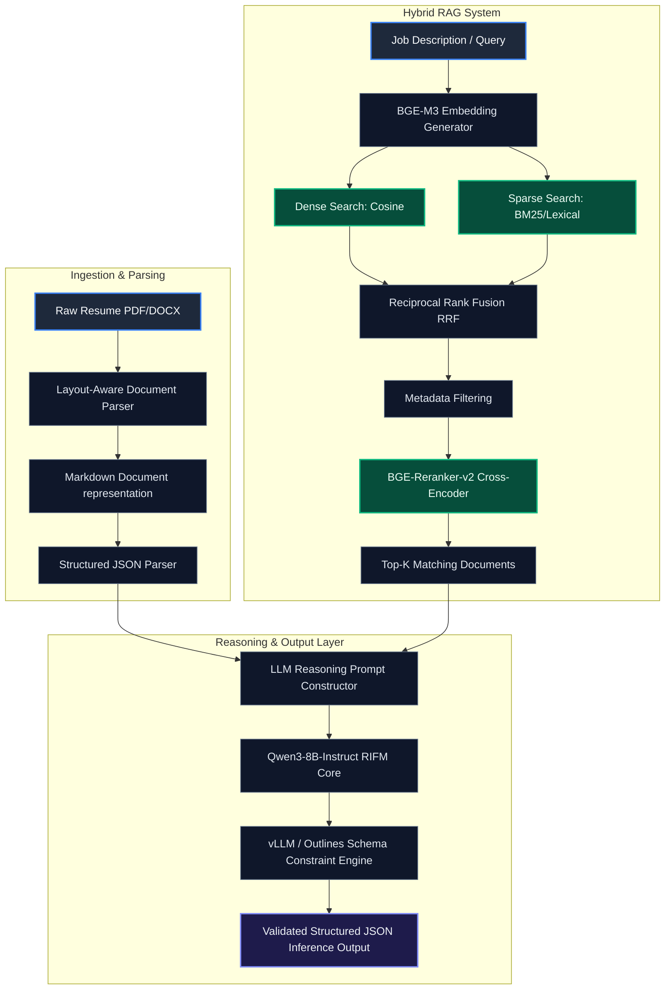
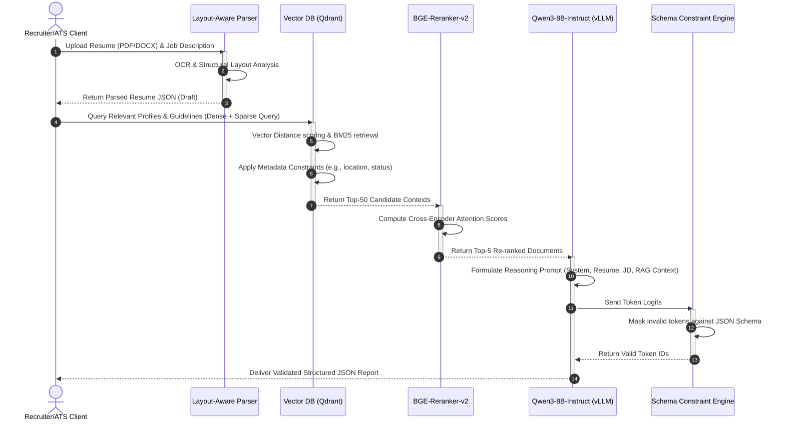
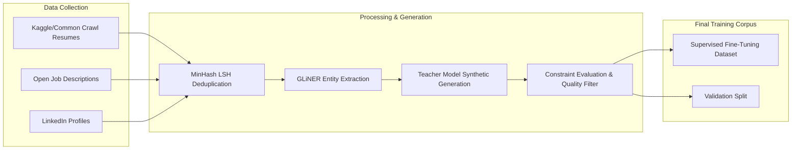
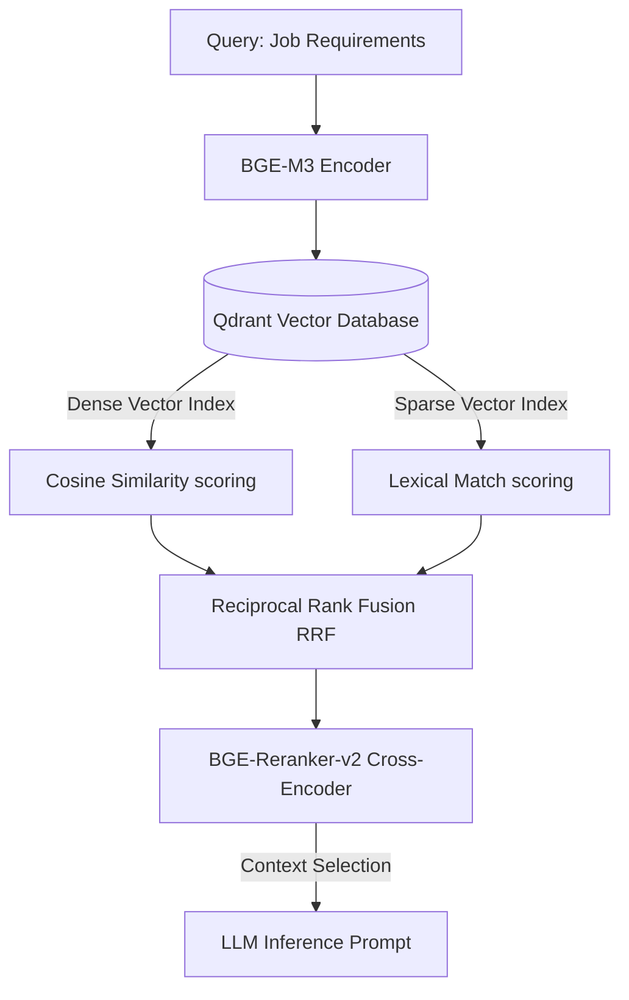
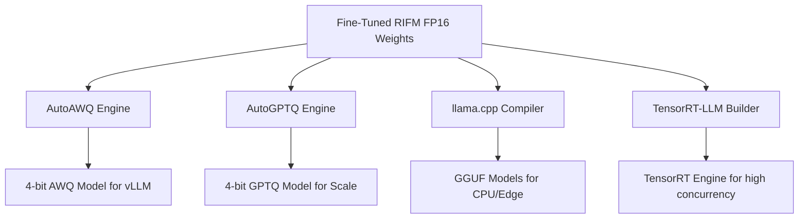
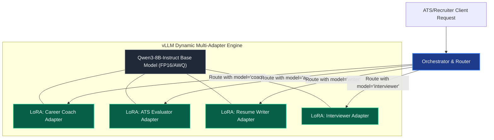
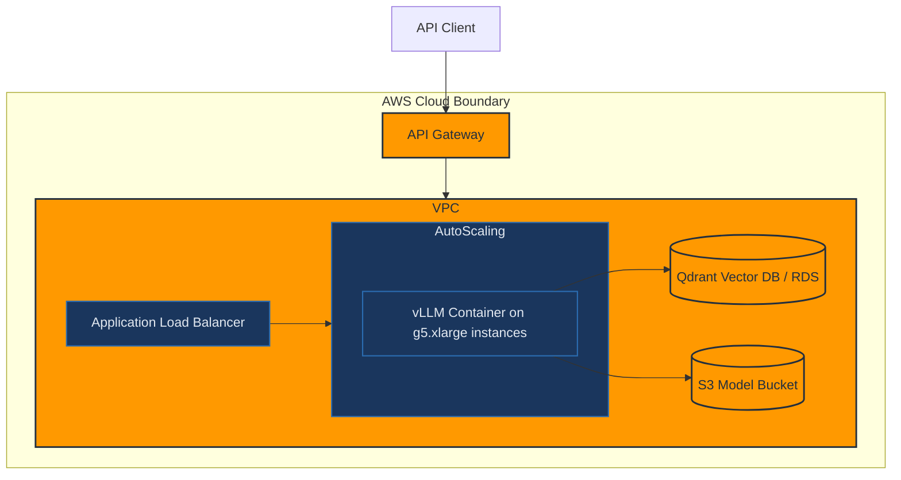

# Technical Design Document: Resume Intelligence Foundation Model (RIFM)

This document specifies the technical design, training pipelines, retrieval mechanisms, quantization configurations, and deployment strategies for the **Resume Intelligence Foundation Model (RIFM)**. RIFM is a domain-specialized generative reasoning system built on a fine-tuned Qwen3-8B-Instruct backbone, optimized for parsing, analyzing, scoring, and matching resumes with job requirements.

---

## 1. Complete System Architecture

RIFM uses a hybrid architecture combining a Layout-Aware Parser, a Hybrid Vector Retrieval System, and a Fine-Tuned Domain-Specific LLM served via high-performance guided decoding.

### 1.1 High-Level Architecture Diagram
The diagram below illustrates the path of documents from ingestion to the structured JSON output.



### 1.2 Data Flow Sequence
The sequence of execution for a matching and scoring request is defined as follows:



---

## 2. Model & Reasoning Architecture

The reasoning backbone of RIFM is built on the **Qwen3-8B-Instruct** architecture.

### 2.1 Model Specifications
- **Architecture**: Decoder-only Autoregressive Transformer.
- **Parameters**: 8.03 Billion active parameters.
- **Attention Mechanism**: Grouped-Query Attention (GQA) with 32 query heads and 8 key-value heads. Reduces KV cache size by 75% compared to Multi-Head Attention.
- **Vocabulary Size**: 151,643 tokens (highly compressed multilingual representation).
- **Position Embeddings**: Rotary Position Embedding (RoPE) configured with a base frequency scaling factor ($\theta = 10,000,000$) to support a native context window up to **131,072 tokens (128K)**.
- **Normalization**: Root Mean Square Normalization (RMSNorm) with SwiGLU activation functions in feed-forward layers.

### 2.2 Reasoning Chain Prompt Strategy
To enforce logical rigor, RIFM uses an internal **Structured Chain-of-Thought (CoT)** schema. The model writes its evaluation steps inside a hidden `<reasoning>` block before outputting structured JSON.

```text
You are the Resume Intelligence Foundation Model (RIFM). Your core competency is detailed recruiter-aligned assessment of professional capability.

Given a Parsed Resume and a Job Description, execute the following reasoning chain:
1. Extraction & Audit: Cross-reference candidate assertions against known institutional timelines.
2. Experience Complexity Estimation: Evaluate project scope, leadership, and technical depth.
3. Skill Gap Identification: Compare candidates' skills with job requirements, classifying into missing, partial, or target skill categories.
4. ATS Metric Analysis: Calculate standard compliance scores using recruiters' parameters.

Write your step-by-step reasoning within a <reasoning> XML tag, then output the final assessment inside the requested JSON schema.
```

---

## 3. Dataset & Training Pipeline

Building the RIFM dataset requires a combination of public data curation, automated cleaning, synthetic generation, and human-in-the-loop validation.



### 3.1 Dataset Strategy
1. **Public Datasets**: Ingestion of the Kaggle Resume dataset, Reddit `/r/resumes` corpora, and open-source corporate job post scraping.
2. **Deduplication via MinHash LSH**: 
   - Resumes and JDs are normalized (lowercase, punctuation removed, tokenized into character $k$-shingles with $k=5$).
   - MinHashing generates 128 hash signatures per document.
   - Banding techniques evaluate pairs matching a Jaccard Similarity threshold:
     $$\text{Jaccard}(A, B) = \frac{|A \cap B|}{|A \cup B|} \ge 0.85$$
   - Highly similar duplicates are pruned, retaining only the longest document.
3. **Synthetic Pair Generation**: 
   - Large teacher models (e.g., Qwen-Max/GPT-4o) generate synthetic resume rewrites and feedback loops.
   - For each input resume, a teacher model generates:
     - Optimization variants (weak vs. strong impact statements).
     - Standardized skill lists matching specific taxonomy structures.
     - Mock recruiter assessment reports.

### 3.2 Instruction Tuning Sample Format
The SFT training instances follow a rigid multi-turn format where inputs are clearly isolated.

```json
{
  "messages": [
    {
      "role": "system",
      "content": "You are the Resume Intelligence Foundation Model. You must output analysis in structured JSON matching the provided schema."
    },
    {
      "role": "user",
      "content": "### JOB DESCRIPTION:\n{\n  \"role\": \"Senior ML Engineer\",\n  \"requirements\": [\"PyTorch\", \"vLLM\", \"CUDA optimization\", \"5+ years experience\"]\n}\n\n### CANDIDATE RESUME:\n{\n  \"name\": \"Alex Chen\",\n  \"experience\": [\n    {\n      \"title\": \"Machine Learning Engineer\",\n      \"duration\": \"3 years\",\n      \"bullets\": [\n        \"Optimized PyTorch inference pipelines using TensorRT.\",\n        \"Built scaling infrastructure using Kubernetes.\"\n      ]\n    }\n  ],\n  \"skills\": [\"PyTorch\", \"Python\", \"TensorRT\", \"Kubernetes\"]\n}"
    },
    {
      "role": "assistant",
      "content": "<reasoning>\n1. Experience Check: Candidate has 3 years of ML engineering experience, which is under the requested 5+ years. \n2. Skill matching: PyTorch is fully matched. vLLM and CUDA optimization are missing from direct listing but TensorRT indicates deep optimization exposure.\n3. Gap identified: Candidate lacks direct vLLM deployment experience and has a 2-year experience gap from the target seniority profile.\n</reasoning>\n{\n  \"ats_score\": 72,\n  \"job_match\": 0.72,\n  \"skill_score\": 80,\n  \"missing_skills\": [\"vLLM\", \"CUDA optimization\"],\n  \"strengths\": [\"Deep experience with PyTorch and model compilation using TensorRT\"],\n  \"weaknesses\": [\"Lacks required 5+ years of industry experience\", \"No direct exposure to vLLM continuous batching\"],\n  \"confidence_score\": 0.90\n}"
    }
  ]
}
```

---

## 4. Fine-Tuning Strategy (QLoRA)

To adapt Qwen3-8B-Instruct while retaining generalization capability, RIFM uses QLoRA (Quantized Low-Rank Adaptation) in 4-bit NormalFloat precision.

### 4.1 PEFT/QLoRA Parameters
Fine-tuning targets all linear projection layers in the self-attention block and Multi-Layer Perceptron (MLP) blocks to maximize adapter coverage.

- **Target Modules**: `q_proj`, `k_proj`, `v_proj`, `o_proj`, `gate_proj`, `up_proj`, `down_proj`.
- **Rank ($r$)**: 64 (high rank ensures capacity to learn parsing structures).
- **Alpha ($\alpha$)**: 128.
- **LoRA Dropout**: 0.05.
- **Quantization Type**: 4-bit NormalFloat (NF4).
- **Double Quantization**: Enabled (saves an additional 0.37 bits per parameter by quantizing quantization constants).
- **Optimizer**: `paged_adamw_8bit` (automatically offloads optimizer states to CPU RAM in spikes to prevent Out-Of-Memory errors).

### 4.2 PEFT Configuration Example (Python)
```python
from peft import LoraConfig, get_peft_model
from transformers import BitsAndBytesConfig
import torch

bnb_config = BitsAndBytesConfig(
    load_in_4bit=True,
    bnb_4bit_use_double_quant=True,
    bnb_4bit_quant_type="nf4",
    bnb_4bit_compute_dtype=torch.bfloat16
)

lora_config = LoraConfig(
    r=64,
    lora_alpha=128,
    target_modules=["q_proj", "k_proj", "v_proj", "o_proj", "gate_proj", "up_proj", "down_proj"],
    lora_dropout=0.05,
    bias="none",
    task_type="CAUSAL_LM"
)
```

### 4.3 DeepSpeed ZeRO-3 Config
```json
{
  "fp16": {
    "enabled": false
  },
  "bf16": {
    "enabled": true
  },
  "zero_optimization": {
    "stage": 3,
    "offload_optimizer": {
      "device": "cpu",
      "pin_memory": true
    },
    "offload_param": {
      "device": "none"
    },
    "overlap_comm": true,
    "contiguous_gradients": true,
    "sub_group_size": 1e9,
    "reduce_bucket_size": "auto",
    "stage3_prefetch_bucket_size": "auto",
    "stage3_param_persistence_threshold": "auto"
  },
  "gradient_accumulation_steps": "auto",
  "gradient_clipping": "auto",
  "train_batch_size": "auto",
  "train_micro_batch_size_per_gpu": "auto"
}
```

---

## 5. Retrieval & Embedding Architecture

A robust retrieval architecture ensures that Qwen3-8B is enriched with semantic references from job taxonomy files, localized salary metrics, and organizational skill graphs.



### 5.1 Embedding Model: BGE-M3
- **Choice**: `BAAI/bge-m3`
- **Justification**: Native support for multilingual inputs, multi-granularity (from short queries to 8192-token documents), and unified output of dense embeddings, sparse lexical weights, and multi-vector representations.
- **Dimensions**: 1024 dimensions.
- **Storage Format**: FP16 elements saved inside a vector database engine (e.g., Qdrant).
- **Sparse Feature Extraction**: Extracts token weights using the sub-word vocabulary projection layer to map vocabulary lexical tokens directly, mimicking BM25 performance without index-level maintenance.

### 5.2 Hybrid Search Formulation
Dense vector search and sparse token search are fused using **Reciprocal Rank Fusion (RRF)**:

$$RRF\_Score(d \in D) = \sum_{m \in M} \frac{1}{k + r_m(d)}$$

Where:
- $M = \{\text{Dense Search}, \text{Sparse Search}\}$ is the set of retrieval models.
- $r_m(d)$ is the rank of document $d$ within search mechanism $m$.
- $k$ is a constant scaling parameter (typically set to $60$ to minimize the impact of outlier rank scores).

### 5.3 Reranking Layer: BGE-Reranker-v2
- **Model**: `BAAI/bge-reranker-large` (v2 cross-encoder variant).
- **Mechanism**: Attention is computed globally across the query-context concatenated text sequence:
  $$\text{Score}(Q, C) = \text{Sigmoid}(\text{MLP}(\text{TransformerEncoder}([CLS] \circ Q \circ [SEP] \circ C)))$$
- **Performance Benefits**: Replaces bi-encoder distance with interactive attention modeling, increasing accuracy for granular matching tasks (e.g. differentiating between "managed PyTorch" vs "contributed to PyTorch codebase").
- **Latency Optimization**: Restricts inference context of reranker to the top 50 documents retrieved, completing scoring in $<40\text{ ms}$.

---

## 6. Quantization & Serving Strategy

Deploying RIFM at scale requires converting the model into highly compressed formats that can run on consumer or cost-effective enterprise GPUs without accuracy degradation.



### 6.1 Quantization Recipes
1. **AWQ (Activation-aware Weight Quantization)**:
   - **Method**: Protects critical weights (top 1% based on activation magnitudes) by applying scaling factors before quantization.
   - **Use Case**: Target format for low-latency multi-concurrency serving with vLLM.
   - **Config**: 4-bit precision, group size 128.
2. **GPTQ**:
   - **Method**: Minimizes mean-squared error (MSE) across token calibration datasets through Hessian matrices scaling.
   - **Use Case**: Offline batch scoring.
3. **GGUF**:
   - **Method**: Quantized via `llama.cpp` using `Q4_K_M` (mixed 4-bit/5-bit quantization scheme optimizing attention projection structures).
   - **Use Case**: Edge execution (recruiter laptops without NVIDIA GPUs).

### 6.2 Serving Architecture: vLLM
Production deployment leverages **vLLM** to support:
- **PagedAttention**: Prevents physical memory fragmentation of the KV cache, increasing serving concurrency by up to 4x.
- **Continuous Batching**: Dynamically inserts newly arrived incoming requests into running batch iterations.
- **Guided Decoding**: Integrates with Outlines to parse JSON output schemas, masking token probabilities to ensure structural validity.

```bash
python -m vllm.entrypoints.openai.api_server \
    --model /models/rifm-qwen3-8b-awq \
    --quantization awq \
    --tensor-parallel-size 1 \
    --max-model-len 32768 \
    --gpu-memory-utilization 0.90 \
    --guided-decoding-backend outlines
```

---

## 7. Evaluation Pipeline

Evaluations assess both linguistic quality and technical alignment against human standards.

### 7.1 Metrics Matrix

| Evaluation Category | Metric Name | Optimization Target | Description |
| :--- | :--- | :--- | :--- |
| **Generative Quality** | ROUGE-L | $> 0.70$ | Evaluates structural consistency of generated feedback profiles. |
| **Semantic Quality** | BERTScore | $> 0.88$ | Deep semantic alignment between ground truth and output suggestions. |
| **ATS Modeling** | Mean Absolute Error (MAE) | $< 5\%$ | Verifies that predicted match score aligns with human recruiter scores. |
| **Skill Profiling** | Skill Extraction F1-Score | $> 0.92$ | Precision and recall metrics for extracted skill items. |
| **Decision Alignment** | Cohen's Kappa ($\kappa$) | $> 0.75$ | Measures inter-annotator agreement between RIFM and senior recruiters. |
| **Inference Latency** | Time-To-First-Token (TTFT) | $< 120\text{ ms}$ | Average latency before first character generation begins. |
| **Throughput** | Tokens per Second | $> 75\text{ tok/sec}$ | Output capacity per user stream. |

---

## 8. Hardware Sizing & Memory Calculations

To assist infrastructure engineers with provisioning, we calculate precise VRAM envelopes for training and serving phases.

### 8.1 Training Memory Formula & Estimation
During backpropagation, VRAM is partitioned into model weights, gradient states, optimizer parameters, activations, and temporary execution memory:

$$V_{\text{total}} = V_{\text{model}} + V_{\text{grad}} + V_{\text{opt}} + V_{\text{act}} + V_{\text{kv}}$$

#### Parameter State VRAM breakdown for 8B Model (in GB):

| Scenario | Model Weights ($V_{\text{model}}$) | Gradient States ($V_{\text{grad}}$) | Optimizer States ($V_{\text{opt}}$) | Base VRAM required |
| :--- | :--- | :--- | :--- | :--- |
| **FP32 Full Precision** | $8 \times 4 = 32\text{ GB}$ | $8 \times 4 = 32\text{ GB}$ | $8 \times 12 = 96\text{ GB}$ | **160 GB** |
| **FP16 Half Precision** | $8 \times 2 = 16\text{ GB}$ | $8 \times 2 = 16\text{ GB}$ | $8 \times 8 = 64\text{ GB}$ | **96 GB** |
| **QLoRA 4-bit (NF4)** | $8 \times 0.5 = 4\text{ GB}$ | $8 \times 2 = 16\text{ GB}$ (FP16) | $0.1 \times 8 = 0.8\text{ GB}$ (Adapters) | **20.8 GB** |

- *Note*: Under QLoRA, only adapter parameters update using optimizer states, reducing $V_{\text{opt}}$ from 64 GB to less than 1 GB.
- **Activation VRAM ($V_{\text{act}}$)**: Scaled by sequence length. In a 32K context window, activation memory scales quadratically. With FlashAttention-2 and gradient checkpointing, this is reduced to a linear footprint ($\sim 12\text{ GB}$ per sequence context).
- **Training GPU Recommendation**: A single **NVIDIA A100 (80GB)** or **H100 (80GB)** easily supports training with large batch sizes.

### 8.2 Serving Memory Sizing
For inference, gradients and optimizer states are inactive, freeing VRAM to host model weights and KV caches:

$$V_{\text{inference}} = V_{\text{model\_weights}} + V_{\text{kv\_cache\_pool}}$$

#### KV Cache Formula:

$$V_{\text{kv\_cache\_pool}} = 2 \times N_{\text{layers}} \times H_{\text{kv\_heads}} \times D_{\text{head\_dim}} \times L_{\text{context}} \times B_{\text{max}} \times \text{Precision\_Bytes}$$

For Qwen3-8B:
- $N_{\text{layers}} = 32$
- $H_{\text{kv\_heads}} = 8$ (due to Grouped-Query Attention)
- $D_{\text{head\_dim}} = 128$
- $L_{\text{context}} = 32,768$ (32K tokens)
- $\text{Precision\_Bytes} = 2$ (FP16)

For a single user sequence ($B_{\text{max}} = 1$):
$$V_{\text{kv}} = 2 \times 32 \times 8 \times 128 \times 32,768 \times 2 \approx 4.29\text{ GB}$$

#### Serving Hardware Tiers:

- **Tier 1: High-Throughput Server (vLLM)**
  - **GPU**: 1x NVIDIA A10G (24GB VRAM) or RTX 4090 (24GB).
  - **Quantization**: 4-bit AWQ ($V_{\text{model}} \approx 4.8\text{ GB}$).
  - **Allocated KV Cache Pool**: $18\text{ GB}$ (supports concurrency of up to 4 concurrent 32K token context sessions, or 16 concurrent 8K context sessions).
- **Tier 2: Enterprise Server (Non-quantized FP16)**
  - **GPU**: 1x NVIDIA A100 (40GB/80GB).
  - **Model Weights**: $16\text{ GB}$.
  - **KV Cache & Buffer**: Remaining space allocated to maximize request concurrency.

---

## 9. API Contracts & JSON Schemas

### 9.1 OpenAPI 3.0 serving specification
```yaml
openapi: 3.0.3
info:
  title: Resume Intelligence Foundation Model (RIFM) API
  version: 1.0.0
  description: Serving interface for parser and extraction operations.
paths:
  /v1/parse:
    post:
      summary: Convert raw resume text or markdown into a structured JSON representation.
      requestBody:
        required: true
        content:
          application/json:
            schema:
              type: object
              properties:
                raw_text:
                  type: string
                  description: Markdown or layout-extracted raw resume text.
              required:
                - raw_text
      responses:
        '200':
          description: Parsing output schema.
          content:
            application/json:
              schema:
                $ref: '#/components/schemas/ParsedResume'
  /v1/analyze:
    post:
      summary: Performs comparative scoring and alignment evaluation against a job description.
      requestBody:
        required: true
        content:
          application/json:
            schema:
              type: object
              properties:
                resume:
                  $ref: '#/components/schemas/ParsedResume'
                job_description:
                  type: object
                  properties:
                    title:
                      type: string
                    requirements:
                      type: array
                      items:
                        type: string
                  required:
                    - title
                    - requirements
              required:
                - resume
                - job_description
      responses:
        '200':
          description: Match analysis report.
          content:
            application/json:
              schema:
                $ref: '#/components/schemas/AnalysisReport'

components:
  schemas:
    ParsedResume:
      type: object
      required: [personal_info, education, experience, skills]
      properties:
        personal_info:
          type: object
          properties:
            name: {type: string}
            email: {type: string}
            phone: {type: string}
            links:
              type: object
              properties:
                github: {type: string}
                linkedin: {type: string}
                portfolio: {type: string}
        education:
          type: array
          items:
            type: object
            properties:
              institution: {type: string}
              degree: {type: string}
              graduation_year: {type: integer}
        experience:
          type: array
          items:
            type: object
            properties:
              company: {type: string}
              title: {type: string}
              start_date: {type: string}
              end_date: {type: string}
              bullet_points:
                type: array
                items: {type: string}
        skills:
          type: array
          items: {type: string}
    AnalysisReport:
      type: object
      required: [ats_score, job_match, skill_score, missing_skills, strengths, weaknesses, reasoning_summary]
      properties:
        ats_score: {type: integer, minimum: 0, maximum: 100}
        job_match: {type: number, minimum: 0, maximum: 1}
        skill_score: {type: integer}
        missing_skills:
          type: array
          items: {type: string}
        strengths:
          type: array
          items: {type: string}
        weaknesses:
          type: array
          items: {type: string}
        reasoning_summary: {type: string}
        confidence_score: {type: number}
```

---

## 10. Model Card

### 10.1 Model Details
- **Developer**: Advanced ML Systems Group.
- **Model Type**: Decoder-only Transformer, fine-tuned using QLoRA.
- **Base Model**: Qwen3-8B-Instruct.
- **Language(s)**: Multilingual support (English, Spanish, Mandarin, German, French, Japanese, Hindi).
- **License**: Custom enterprise usage agreement.

### 10.2 Intended Use
- **Primary Use Cases**: High-volume candidate screening, skill extraction and normalization, ATS semantic matching, resume rewriting, and career pathing.
- **Out of Scope**: Direct performance appraisals of current employees, background checking, or automated firing systems.

### 10.3 Factors and Biases
- **Bias Mitigation Strategy**:
  - Training dataset features demographic scrubbers (names, gender pronouns, locations, graduation dates, and ethnic indicators are synthetically masked during supervised training).
  - Explicit balancing is applied to prevent institutional target matching bias (e.g., historical underrepresentation patterns in corporate datasets).
- **Limitations**:
  - Performance degrades on documents with non-standard spatial layouts (e.g. multi-column circular graphics, graphical timelines) unless parsed into structural markdown first.

---

## 11. Production Readiness Checklist

Before moving to production, complete the following validation checklist:

- [ ] **JSON Validation Gate**: Configure API gateways to block and retry requests when the schema constraint engine fails to parse model output.

---

## 12. Scalability Roadmap: Multi-Agent Resume Intelligence

To prevent model bloat and high infrastructure costs, RIFM uses a **Multi-Adapter Multi-Agent Architecture**. Rather than deploying separate 8B parameters base models for each task (Career Coach, Recruiter, Writer, etc.), we share a single parent Qwen3-8B-Instruct base model and load task-specific **PEFT LoRA Adapters** dynamically at runtime.



### 12.1 Multi-Agent Roles
1. **Career Coach Agent**: Focuses on long-term pathing, skill acquisition schedules, and market compensation trajectories.
2. **ATS Agent**: Specialized in structural scanning, keyword parsing, compliance matching, and hard constraint validation.
3. **Recruiter Agent**: Tailored to evaluate soft skills, project complexity, prestige signals (universities, selective companies), and leadership capabilities.
4. **Resume Rewrite Agent**: Fine-tuned on parallel datasets of weak/strong action verbs, impact statements, and formatting patterns.
5. **Interview Agent**: Generates technical, structural, and behavioral questions based on resume experience gaps and job requirements.

### 12.2 Serving Implementation
vLLM supports concurrent multi-adapter execution using a single base model. Start the vLLM server with LoRA enabled:

```bash
python -m vllm.entrypoints.openai.api_server \
    --model /models/rifm-qwen3-8b-base \
    --enable-lora \
    --max-loras 5 \
    --max-lora-rank 64 \
    --lora-extra-vocab-size 256
```

Requests route to specific agents using standard chat completion headers:
```json
{
  "model": "rifm-ats-adapter",
  "messages": [{"role": "user", "content": "..."}]
}
```

---

## 13. Future Research Directions

1. **Reasoning Distillation (Teacher-Student Alignment)**:
   - Distill thinking trajectories from large reasoning models (such as Qwen-Max-Long-Thought or DeepSeek-R1) into the RIFM-8B weights.
   - Utilize KL-Divergence minimization on the hidden `<reasoning>` tokens during instruction tuning to replicate advanced search and verification logic.
2. **Reinforcement Learning from Recruiter Feedback (RLAIF/RLHF)**:
   - Construct a pairwise preference dataset containing different resume rewrite variants scored by human recruiters.
   - Fine-tune via **Direct Preference Optimization (DPO)** or **Kahneman-Tversky Optimization (KTO)** to match human styling preferences.
3. **Native Multi-Modal Document Extraction**:
   - Integrate a lightweight vision encoder (e.g. SigLIP) with the Qwen text model to process resumes directly as image screenshots. This bypasses structural losses introduced by text extraction engines on highly customized visual layouts.

---

## 14. Risks and Limitations

1. **Hallucination of Career Events**:
   - *Risk*: Generative rewriting models can invent false metrics, job titles, or project results.
   - *Mitigation*: Run strict semantic difference audits between original and generated bullets. Block suggestions that include numerical claims (e.g., "boosted revenue by 40%") not derived from user-provided drafts.
2. **Implicit Profile Bias**:
   - *Risk*: Despite name and demographic scrubbing, models can display bias based on university rankings, corporate names, or regional linguistic structures.
   - *Mitigation*: Balance training sets across multiple tiers of academic institutions and regional companies. Continuously monitor model scoring outputs for statistical parity.
3. **Context Length Squeezing**:
   - *Risk*: Large corporate resumes containing lengthy project portfolios can exceed context limits during dense RAG injection.
   - *Mitigation*: Limit retrieval contexts using cross-encoder rerankers, keeping inference prompts under 16K tokens.

---

## 15. Repository Folder Structure

The following folder structure specifies the design for the RIFM codebase:

```text
ai-resume-analyser/
├── config/                         # Configuration templates
│   ├── deepspeed_zero3.json        # DeepSpeed training configs
│   ├── peft_lora_config.json       # PEFT parameters
│   └── serving_config.yaml         # vLLM parameters
├── data/                           # Data storage and pipelines
│   ├── raw/                        # Ingested datasets (Scraped resumes, JDs)
│   ├── processed/                  # Normalized and deduplicated datasets
│   └── scripts/
│       ├── deduplicate_lsh.py      # MinHash LSH deduplication script
│       └── generate_synthetic.py   # Self-Instruct generation pipeline
├── src/                            # Codebase Source
│   ├── parser/
│   │   ├── document_parser.py      # OCR & Markdown extractor
│   │   └── schema_verifier.py      # Outlines validation wrappers
│   ├── search/
│   │   ├── embedder.py             # BGE-M3 dense/sparse embedding logic
│   │   ├── hybrid_retriever.py     # Vector DB (Qdrant) query handler
│   │   └── reranker.py             # BGE-Reranker-v2 interface
│   └── training/
│       ├── train.py                # Main SFT fine-tuning training entry point
│       └── evaluate.py             # Accuracy and NLP metric evaluation
├── tests/                          # Unit and integration tests
├── Dockerfile                      # Production build instructions
├── docker-compose.yml              # Cluster/service orchestration
└── requirements.txt                # Dependency constraints
```

---

## 16. Deployment Readiness & AWS Considerations

For production deployment, RIFM can be integrated using one of two primary pathways on AWS:



### 16.1 Self-Hosted quantized inference on AWS ECS/EKS
- **Compute Instance**: `g5.xlarge` (1x NVIDIA A10G, 24GB VRAM) or `g5.2xlarge`.
- **Infrastructure**: Containerized vLLM serving the 4-bit AWQ model. Weights are loaded directly from a secured AWS S3 bucket during container initialization.
- **Auto-Scaling**: Configured using target tracking metrics on CPU/GPU utility, launching new container instances when concurrency metrics spike.

### 16.2 AWS Bedrock Custom Model Import
- **Pathway**: If low-maintenance serverless hosting is preferred, RIFM can be deployed via **Bedrock Custom Model Import**.
- **Process**:
  1. Export the fine-tuned adapter merged model in FP16 format to AWS S3.
  2. Initiate a Custom Model Import job in Amazon Bedrock targeting the Qwen3-8B-Instruct framework.
  3. Serve RIFM using Bedrock's serverless Provisioned Throughput endpoints, maintaining native AWS IAM access controls, VPC endpoints, and encryption.

